Summary: This repository contains scripts for automating the download of resources (videos, PDFs, etc.) from the Hello IITK website, scraping forum data, and converting quiz/assignment data into PDFs. It uses libraries like `requests`, `BeautifulSoup`, `pandas`, `pdfkit`, `PyInquirer`, `tqdm`, and `youtube_dl`.  The main script, `downloader.py`, handles user login, course selection, and resource/video downloading, with options for supplemental materials.  `forumsScrapper.py` extracts forum questions, `quiz_assignment_scrapper.py` retrieves and formats quizzes and assignments into PDFs, and helper scripts `html2pdf.py` and `html_list.py` handle HTML-to-PDF conversion and HTML formatting, respectively.

Mermaid Syntax:

```mermaid
graph TB
    subgraph Main Flow [downloader.py]
        A[Start] --> B(User Login)
        B --> C{Login Successful?}
        C -- Yes --> D[Get Course List]
        D --> E(User Selects Course)
        E --> F[Fetch Resources & Videos]
        F --> G(Choose Resource Type: Videos, Resources, Supp)
        G --> H{Resource Type Selected?}
        H -- Videos --> I[Download Videos]
        H -- Resources --> J[Download Resources]
        H -- Supp --> K[Download Supplemental Resources]
        I --> L[End]
        J --> L
        K --> L
        C -- No --> M[Exit]
    end

    subgraph Forum Scraper [forumsScrapper.py]
      N[Start] --> O(User Login)
      O --> P{Login Successful?}
      P -- Yes --> Q[Get Course List]
      Q --> R(User Selects Course)
      R --> S[Fetch Forum Data by Page]
      S --> T{More Pages?}
      T -- Yes --> S
      T -- No --> U[Save Forum Data to CSV]
      U --> V[End]
      P -- No --> W[Exit]
    end

    subgraph Quiz/Assignment Scraper [quiz_assignment_scrapper.py]
      X[Start] --> Y(User Login)
      Y --> Z{Login Successful?}
      Z -- Yes --> AA[Get Course List]
      AA --> BB(User Selects Course)
      BB --> CC[Fetch Quiz/Assignment Summary]
      CC --> DD{Quizzes Found?}
      DD -- Yes --> EE[Process Each Quiz]
      EE --> FF[Convert Quiz to HTML]
      FF --> GG[Convert HTML to PDF]
      GG --> HH{More Quizzes?}
      HH -- Yes --> EE
      HH -- No --> II{Assignments Found?}
        II -- Yes --> JJ[Process each Assignment]
          JJ --> KK(Save Assignment Data)
          KK-->LL{More Assignment}
            LL--Yes-->JJ
            LL--No-->MM[END]
        II -- No --> MM
      DD -- No --> II
      Z -- No --> NN[Exit]
    end
    
    subgraph Helper Functions
        OO[html_list.py] --> PP(Format JSON to HTML)
        QQ[html2pdf.py] --> RR(Convert HTML to PDF)
    end

    linkStyle 0,1,2,3,4,5,6,7,8,9,10,11,12,13,14,15,16,17,18,19,20,21,22,23,24,25,26,27,28,29,30,31,32,33,34,35,36,37,38,39,40,41,42 stroke:#000,stroke-width:1px;
```

